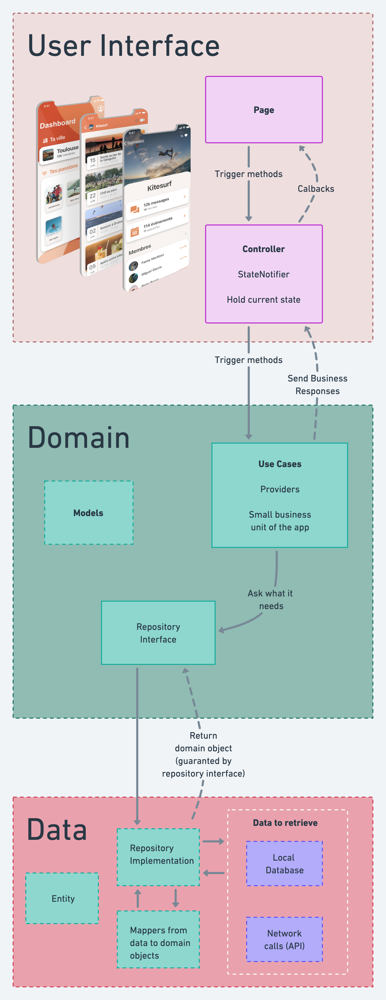
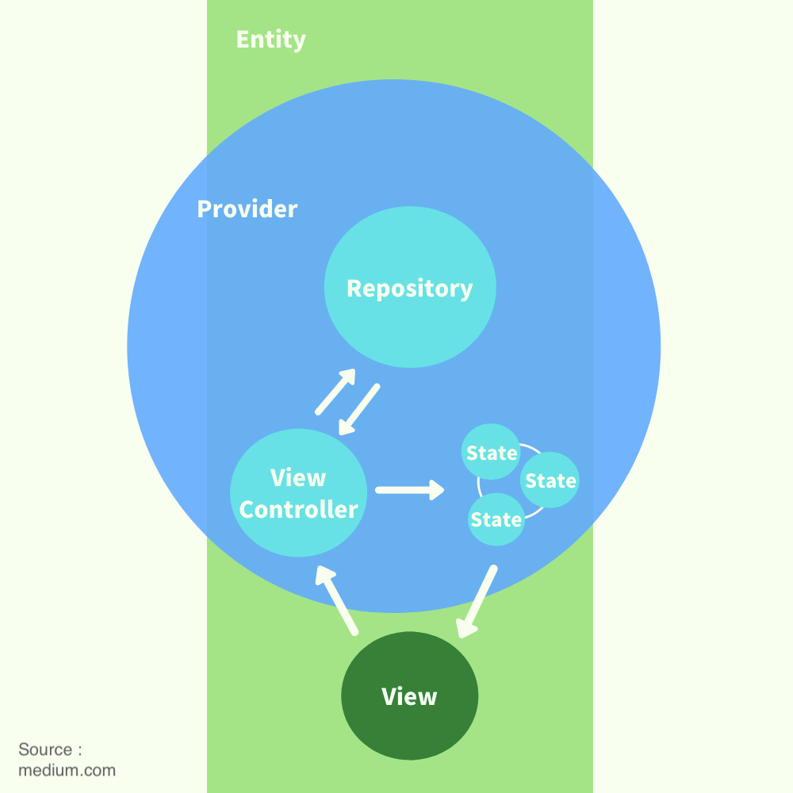
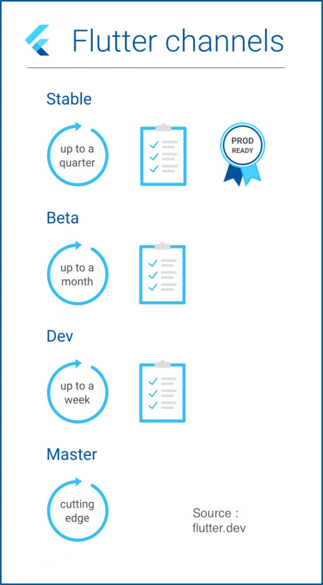

# projectsnowball

projectsnowball has been built with Mason, using the brick hello_riverpod.

## Getting started

### Clone project and handle theme

To clone project, run :

`git clone --recurse-submodules https://...`

To load last changes in theme, run the command :

`git submodule update --remote`

### Running the project

To compile the project, run the following command :

```shell
flutter run --flavor {FLAVOR} -t main_{FLAVOR}.dart
```

💡 Replace {FLAVOR} by the one of the following flavors :

- development
- staging
- production

Example :

```shell
flutter run --flavor development -t main_development.dart
```

If you need to specify the device, add the argument :
`-d {DEVICE_ID}`

💡 Replace {DEVICE_ID} by the ID of your target device. You can find it by running the command `flutter devices`

If this is the first time you run the project, or if you edited some files annotated with @freezed, you might want to run this command before running the project :
`flutter pub run build_runner build --delete-conflicting-outputs`

### Deliveries

#### Android

Run the command : `flutter build apk`

#### iOS

Make sure to prepare your files `ExportOptions.plist` in the iOS folder.

Then, run the following command :

`flutter build ipa --export-options-plist=ios/ExportOptions.plist`

## Architecture

### App diagram

The architecture is summed up in the following diagram :



### State Management : Riverpod

We chose [Riverpod](https://riverpod.dev/) as a solution for State Management.

Here is a diagram that shows how providers and states are organized in the project :



### Directory Tree

The architecture is mainly feature-first, with the exception of the data layer.

```text
---/assets/
---/lib/
    ---/bootstrap.dart
    ---/main_development.dart
    ---/main_production.dart
    ---/main_staging.dart
    ---/app/
        ---/app.dart
        ---/routing/
    ---/data/
        ---/models/
            ---/model1.dart
            ---/model2.dart
        ---/repository/    
    ---/i18n/
        ---/main_fr.i18n.yaml
        ---/main.i18n.yaml
    ---/features/
        ---/feature1/
            ---/providers/
                ---/xxx_provider.dart
            ---/views/
                ---/feature1_screen.dart
                ---/widget1.dart
                ---/widget2.dart
        ---/feature2/
            ---/constants.dart
            ---/helpers/
            ---/providers/
            ---/services/
            ---/views/
    ---/shared/
        ---/constants.dart
        ---/helpers/
            ---/extensions/
                ---/string_extensions.dart
                ---/xxx_extensions.dart
        ---/providers/
            xxx_provider.dart
        ---/views/
        ---/services/
            ---/log.dart
            ---/camera_service.dart    
```

### Clean Architecture

We rely as much as possible on the Clean Architecture.
It is important to distinct the following layers in the code :

- Entities
- Database provider
- Repository
- Business logic
- UI

## Git Workflow

### Branch tree

Syntax for the name of branches : kebab-case

- master
  - develop
    - "sprint1"
      - "1-name-of-featureA"
      - "1-name-of-featureB"
    - "sprint2"
      - "2-name-of-featureA"
      - "2-name-of-featureB"
      - "2-name-of-featureC"
    - etc ...

### Flow

Feature is finished :

- Commit
- If necessary, pull sprintX and rebase sprintX over feature-branch
- PR feature-branch into sprintX
- Create next feature branch from branch sprintX

### Commits

#### Description

**All commits should be formatted like this :**

```text
<type>(<optional scope>): <subject>

<optional body>

<optional footer>
```

| Type       | Description                                    |
|------------|------------------------------------------------|
| [feat]     | New feature for the user                       |
| [build]    | Develop architectural features                 |
| [chore]    | Update grunt tasks                             |
| [refactor] | Restructure code, rename fields                |
| [test]     | Add/edit some tests                            |
| [fix]      | Repair a bug, correct a mistake                |
| [loc]      | Change localization configuration/translations |
| [pub]      | Edit pubspec/build/analysis files.             |
| [lint]     | Fix linter problems                            |
| [clean]    | Remove dead code, make it more readable        |
| [readme]   | Apply changes to the README file               |
| [doc]      | Update documentation                           |

- `<optional scope>` describes the feature or the file that is edited. This field is optional.
- `<subject>` gives a short description about the edited code in the last commit.
- `<optional body>` provides a longer description to describe the commit more precisely. This field is optional.
- `<optional footer>` specifies the ticket in progress, or some references, if they are needed. This field is optional.

#### Notes

- If the work is in progress, you should prefix the commit message by `[WIP]`.
- All commit messages should be written in the present tense
- If there is a breaking change, add `!` after `<type>`, before `:`

#### Examples of commit message

```text
feat: change color button 'send'
build: import package flutter_riverpod in pubspec
refactor!: new library for navigation (go_router)
chore!: update version go_router
```

#### Sources

This syntax has been inspired by the following contents :

- [Conventional Commits](https://www.conventionalcommits.org/en/v1.0.0/)
- [Gist by @joshbuchea](https://gist.github.com/joshbuchea/6f47e86d2510bce28f8e7f42ae84c716)

### Versioning with tags

The tags should follow the following rules :

- The Major should only be incremented if the product faces considerable changes, and the sprint number is reset to 1. It normally starts at 1
- The Minor is the number of the sprint
- The Build Revision can be incremented for any fixes delivered to the client

For example, if this is the third revision of the sprint 4, the tag should be 1.4.3 :
`git tag -a 1.4.3 9feeb02 -m "Fixed border yellow button"`

If we create a tag "1.2.0" somewhere, every builds' versionName will be "1.2.0" suffixed with commit hash, and versionCode equal to the list of tags on this git repository.
If the current commit is the one pointed by the last tag, then the commit hash is omitted.

## Technical stack

### Flutter

The app is developed in Flutter. More info on [flutter.dev](https://flutter.dev)
The app can run on [several platforms](https://docs.flutter.dev/reference/supported-platforms).

#### Flutter Channels

We must use as much as possible the channel "stable" for production deliveries.
We can switch to "beta" to use a recent feature, or to fix a problem not released on "stable"
However, we should never use "master" or "dev" channels.



## UI

The UI is designed to fit in a screen with a dimension of at least 4.0 inches.

### Fonts

The default fonts are used for this project.
