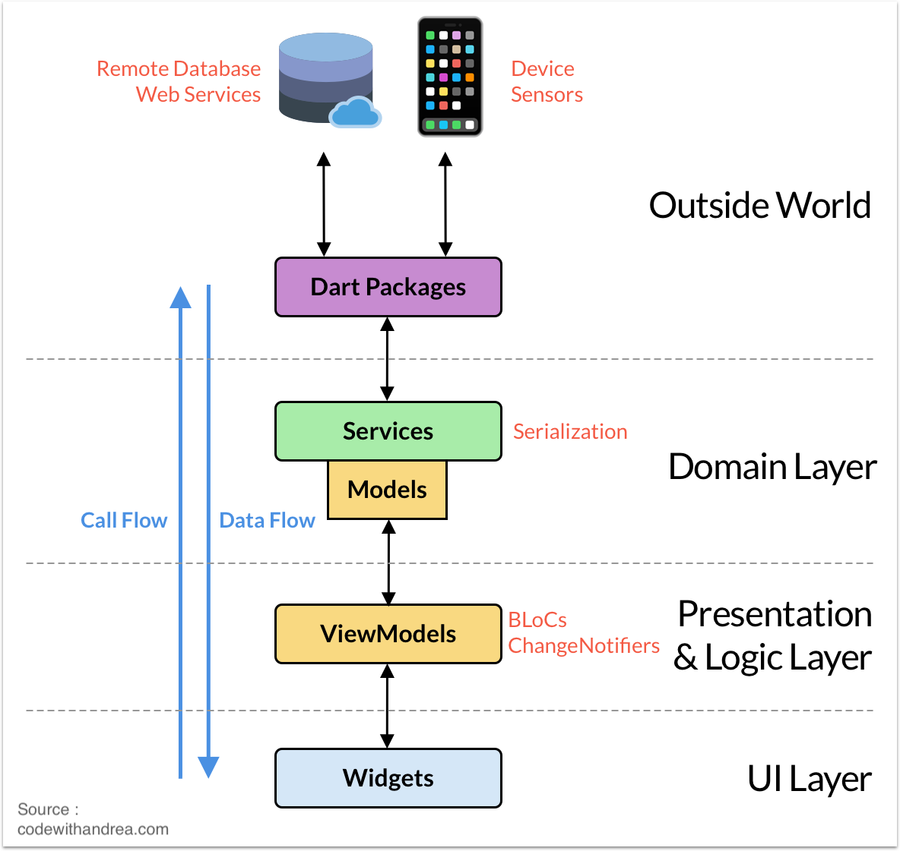

# APP

Description of APP

## Prerequisites
APP runs on following devices :
- Android >= API 19
- iOS >= iOS 10.12


# Getting started

## Clone project and handle theme
To clone project, run :

`git clone --recurse-submodules https://...`

To load last changes in theme, run the command :

`git submodule update --remote`


## Running the project

### Run from Terminal
To compile the project, run the following command :
```
flutter run --flavor {FLAVOR} -t main_{FLAVOR}.dart
```

💡 Replace {FLAVOR} by the one of the following flavors :
- development
- staging
- production

Example :
```
flutter run --flavor development -t main_development.dart
```

If you need to specify the device, add the argument :
`-d {DEVICE_ID}`

💡 Replace {DEVICE_ID} by the ID of your target device. You can find it by running the command `flutter devices`

If this is the first time you run the project, or if you edited some files annotated with @freezed, you might want to run this command before running the project :
`flutter pub run build_runner build --delete-conflicting-outputs`


## Deliveries
### Android
Run the command : `flutter build apk`

### iOS
Make sure to prepare your files `ExportOptions.plist` in the iOS folder.

Then, run the following command :

`flutter build ipa --export-options-plist=ios/ExportOptions.plist`

# Architecture
## App diagram
The architecture is summed up in the following diagram :


## State Management : Riverpod
We chose [Riverpod](https://riverpod.dev/) as a solution for State Management.

Here is a diagram that shows how providers and states are organized in the project :


## Directory Tree
```
lib
---/app/
	---/routing
        ---/app_routes.dart
    ---/app.dart
---/modules/
	---/moduleX/
    ---/moduleY/
---/shared/
	---/helpers
		---/extensions.dart
		---/print.dart
	---/riverpod
    	---/app_state.dart
---/main.dart

```

## Clean Architecture
We rely as much as possible on the Clean Architecture.
It is important to distinct the following layers in the code :
- Database provider
- Entities
- Repository
- UI



# Git Workflow
## Branch tree :
Syntax for the name of branches : kebab-case

- master
    - develop
        - "sprint1"
            - "1-name-of-featureA"
            - "1-name-of-featureB"
        - "sprint2"
            - "2-name-of-featureA"
            - "2-name-of-featureB"
            - "2-name-of-featureC"
        - etc ...

## Flow

Feature is finished :
- Commit
- If necessary, pull sprintX and rebase sprintX over feature-branch
- PR feature-branch into sprintX
- Create next feature branch from branch sprintX

## Commits :

**All commits should be formatted like this :**

`git commit "Name of feature - description of last task"`

| Préfixe   | Description                                 |
|-----------|---------------------------------------------|
| [clean]   | clean code                                  |
| [wip]     | work in progress : tâche arrêté non terminé |
| [wording] | clean wording                               |
| [fix]     | fix bug                                     |
| [refacto] | refactoring code                            |
| [doc]     | ajout de documentation du code              |

*Ex of commit message :* **Navigation : [wip] add top right button**

## Versioning with tags

The tags should follow the following rules :
- The Major should only be incremented if the product faces considerable changes, and the sprint number is reset to 1. It normally starts at 1
- The Minor is the number of the sprint
- The Build Revision can be incremented for any fixes delivered to the client

For example, if this is the third revision of the sprint 4, the tag should be 1.4.3 :
`git tag -a 1.4.3 9feeb02 -m "Fixed border yellow button"`

If we create a tag "1.2.0" somewhere, every builds' versionName will be "1.2.0" suffixed with commit hash, and versionCode equal to the list of tags on this git repository.
If the current commit is the one pointed by the last tag, then the commit hash is omitted.

# Technical stack
## Flutter
The app is developed in Flutter. More info on [flutter.dev](https://flutter.dev)

### Flutter Channels
We must use as much as possible the channel "stable" for production deliveries.
We can switch to "beta" to use a recent feature, or to fix a problem not released on "stable"
However, we should never use "master" or "dev" channels.


# UI

The UI is designed to fit in a screen with a dimension of at least 4.0 inches.

## Fonts

The default fonts are used for this project.
