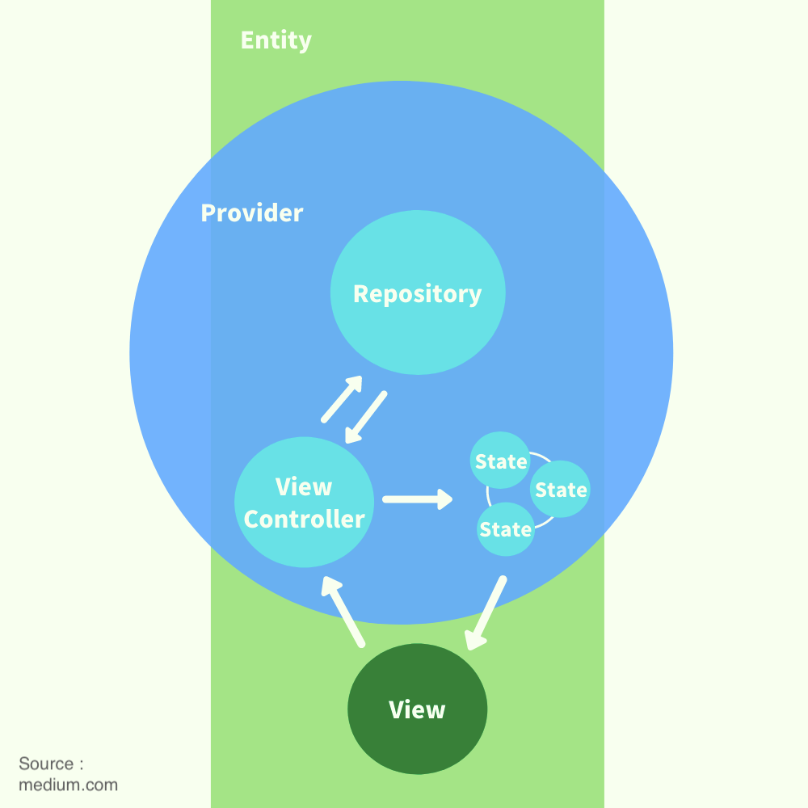

# {{projectName}}

{{projectName}} has been built with Mason, using the brick hello_riverpod.

## Getting started

### Running the project

#### Run from Terminal

To compile the project, run the following command :

```shell
flutter run --flavor {FLAVOR} -t main_{FLAVOR}.dart
```

💡 Replace {FLAVOR} by the one of the following flavors :

- development
- staging
- production

Example :

```shell
flutter run --flavor development -t main_development.dart
```

If you need to specify the device, add the argument :
`-d {DEVICE_ID}`

💡 Replace {DEVICE_ID} by the ID of your target device. You can find it by running the command `flutter devices`

If this is the first time you run the project, or if you edited some files annotated with @freezed, you might want to run this command before running the project :
`flutter pub run build_runner build --delete-conflicting-outputs`

### Deliveries

#### Android

Run the command : `flutter build apk`

#### iOS

Make sure to prepare your files `ExportOptions.plist` in the iOS folder.

Then, run the following command :

`flutter build ipa --export-options-plist=ios/ExportOptions.plist`

## Architecture

### State Management : Riverpod

We chose [Riverpod](https://riverpod.dev/) as a solution for State Management.

Here is a diagram that shows how providers and states are organized in the project :


